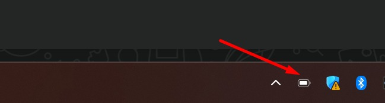
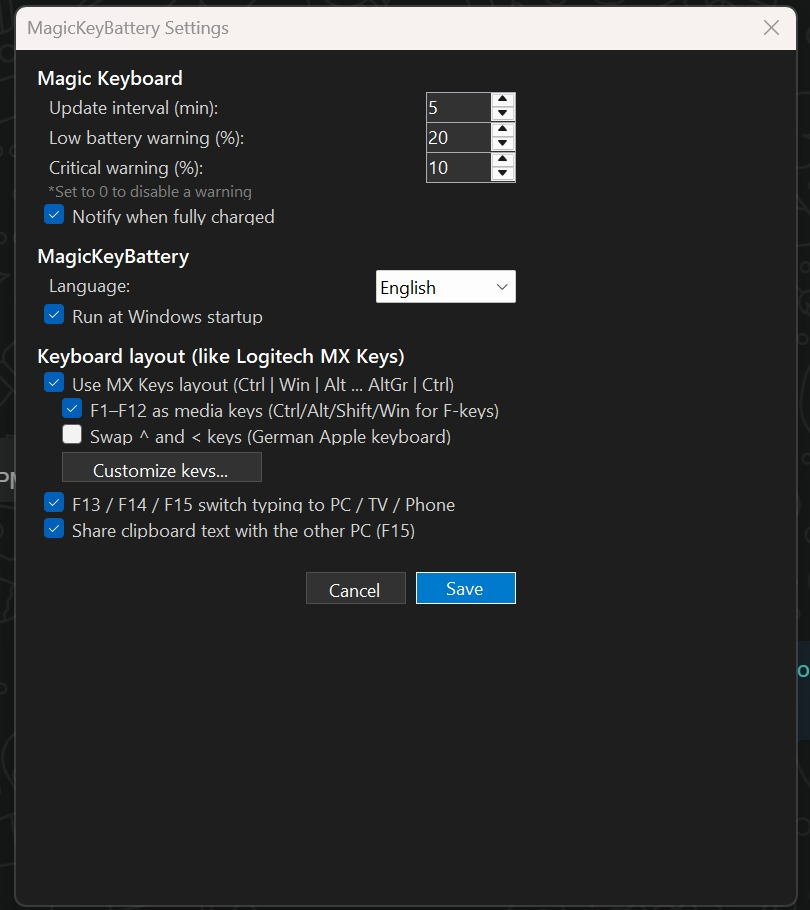

# MagicKeyBattery — Apple Magic Keyboard for Windows

A lightweight Windows tray app that makes the **Apple Magic Keyboard** feel at home on Windows:
battery level and history, a Logitech MX Keys–style layout with media keys, fully customizable keys,
and Easy-Switch–style typing on your **PC, LG TV, Android phone or another PC** with one key.

**[⬇ Download the portable version](https://github.com/AhmedMostafaElsharkawy/AppleMagicKeyForWindows/releases/latest)** — no installation, no .NET needed (Windows 10/11, 64-bit).

<p align="center">
  
  <br><br>
  
</p>

## Features

### 🔋 Battery
- Live battery level drawn as the tray icon (no icon files — rendered in memory).
- Low and critical battery warnings (configurable, 0 = off) and an optional "fully charged" notification.
- **Battery history** window: 24 h / 7 days / 30 days / all, average drain per day, estimated time left, last charge, CSV export.
- Reads the keyboard directly over HID (report `0x90`) even while Windows holds it for typing — works alongside Magic Utilities.

### ⌨️ Keyboard layout (like Logitech MX Keys)
- Modifier order `Ctrl | Win | Alt … AltGr | Ctrl`.
- **F1–F12 as media keys** (brightness, Task View, Start, previous / play-pause / next, mute, volume). Hold Ctrl, Alt, Shift or Win for the normal F-key.
- Optional swap of the `^` and `<` keys (German / ISO Apple keyboards).
- **Customize keys…**: choose what every top-row key, F13–F19 and modifier does (media, Windows shortcuts, screen snip, lock, calculator, …). "MX Keys defaults" restores the defaults.

### 🔀 Switch where you type (F13 / F14 / F15)
| Key | Types on |
|---|---|
| **F13** | This PC |
| **F14** | **LG webOS TV** — arrows, OK, Back, Home, volume, play/pause, channel numbers, and real text input when a search box is open on the TV |
| **F15** | **Android phone** (via scrcpy / wireless debugging) **or another Windows PC** running MagicKeyBattery |

**TV channels:** `Ctrl` / `⌘` / `Option` + `↑` or `→` = next channel, + `↓` or `←` = previous channel.
Arrows alone move through the TV menus. `Page Up` / `Page Down`, `F5` / `F6` and numpad `+` / `−` also change channels.

- **Clipboard sharing** with the other PC while you are typing on it (F15).
- Set up the TV, phone and other PC from **Devices** in the tray menu (TV discovery and pairing included).

### 🌐 Other
- English, Japanese and **Arabic (right-to-left)** UI; follows the Windows language by default.
- Run at Windows startup.
- Portable: settings, key layout and battery history are saved next to the exe in `MagicKeyBattery-data`
  (falls back to `%LOCALAPPDATA%\MagicKeyBattery` if that folder is not writable).
- Very low overhead: ~0% CPU when idle, ~20 MB RAM.

## 🔒 Security
- TV: encrypted WebSocket (`wss`, port 3001) only, with the TV certificate pinned after pairing — never plain `ws`.
- Other PC: TLS, certificate pinned after pairing with a 6-digit code; only local-network addresses are accepted.
- Pairing keys are encrypted for your Windows account (DPAPI), so they cannot be copied to another PC.

## 🛠️ Verified device
- **Apple Magic Keyboard with Numeric Keypad** (Product ID `026C`, Bluetooth)
- LG webOS TV (webOS 4.x), Samsung Galaxy S24 Ultra (scrcpy)

## 🚀 Build from source

Requires the **.NET 9 SDK** (Windows Desktop).

```bash
dotnet run
```

Portable single-file build (no .NET needed on the target PC):

```bash
dotnet publish -c Release -r win-x64 --self-contained true -p:PublishSingleFile=true -p:IncludeNativeLibrariesForSelfExtract=true
```

The exe is created in `bin/Release/net9.0-windows10.0.19041.0/win-x64/publish/`.

## 📜 License

MIT — see [LICENSE](LICENSE).
