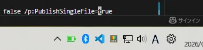
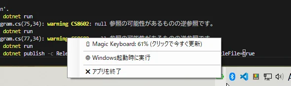
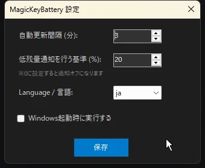
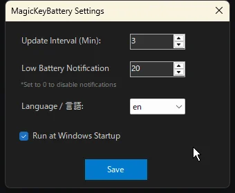

# MagicKeyBattery

A lightweight, zero-asset Windows system tray application to monitor the battery level of the Apple Magic Keyboard (Numeric Keypad / Touch ID models) via Win32 HID API.

<p align="center">
  
  <br><br>
  
  <br><br>
  
  <br><br>
  
</p>

## Features

- **Zero External Assets**: No `.ico` files required. The tray icon is rendered dynamically in memory, pixel by pixel, reflecting the exact battery percentage.
- **Sleek Configuration UI**: A dark-themed settings dialog to easily customize update intervals and low-battery notification thresholds without bloated UI frameworks.
- **Multilingual Support**: Automatically detects Windows OS locale (defaults to English) and supports dynamic runtime language switching (English / Japanese).
- **Silent Background Updates**: Status polling runs completely in the background, eliminating any context menu flickering during status updates.
- **Smart Low-Battery Notifications**: Triggers a Windows system toast notification once when the battery drops below your specified threshold (built-in duplicate prevention).
- **Bypass Exclusive Lock**: Uses a smart Win32 `CreateFile` hack (Access: 0) to communicate with the device even while Windows holds an exclusive lock for typing input.
- **Seamless Startup Integration**: Easily toggle "Run at Windows Startup" directly from the configuration dialog (Registry-backed).
- **Ultra Low Overhead**: Optimized polling interval that consumes virtually zero CPU, Bluetooth bandwidth, or keyboard battery.

## 🛠️ Verified Device

- **Apple Magic Keyboard with Numeric Keypad** (Product ID: `026c`)
  - Connection: Bluetooth Classic (HID)
  - Report ID: `0x90` (Input Report, 3rd byte)

## 🚀 How to Run / Build

### Prerequisites
- .NET 10 SDK (Windows Desktop workload)

### Running from source
Clone the repository and run the following command in PowerShell:

```bash
dotnet run

```

### Building the executable

To generate a standalone, single-file executable:

```bash
dotnet publish -c Release -r win-x64 --self-contained false /p:PublishSingleFile=true

```

The compiled executable will be generated in `bin/Release/net10.0-windows.../publish/`.

## 📜 License

This project is licensed under the **MIT License** - see the [LICENSE](https://www.google.com/search?q=LICENSE) file for details.

